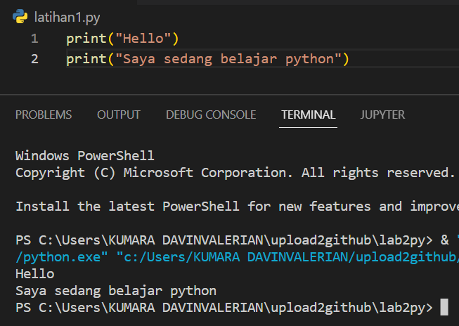

## **Proses / Langkah-Langkah Praktikum**

### **Latihan 1**
Menjalankan python console
#### 1. Menjalankan tulisan "Hello" dilayar
#### 2. Menampilkan tulisan "Saya sedang belajar python" dilayar

### **LATIHAN 2**
Menjumlahkan dua buah variabel bilangan menggunakan variabel a dan b
1. Mendenifisikan variabel a dengan nilai 8
2. Mendenifisikan variabel b dengan nilai 6
3. Mencetak nilai variabel a dan b 
4. Mencetak hasil penjumlahan a+b

### **LATIHAN 3**
Menjalankan IDLE
1. Membuat file baru dengan nama latihan3.py (pastikan lokasi file pada folder lab2py pada direktori anda)
2. Menggunakan fungsi input untuk mengambil nilai variabel dari keyboard

### **Langkah-Langkah Mengggunakan PyCharm**
1. silahkan download di https://www.jetbrains.com/pycharm/
2. Setelah selesai instalisasi, buka **PyCharm**
3. Membuat laman kerja baru dengan menekan (+) atau *Create New Project*

### Virtual Environment

### Menambahkan File Baru

### Menjalankan Program

=======

>>>>>>> 40bafeb2e1f59fb11ff81584a5120ac61e60ff7f
